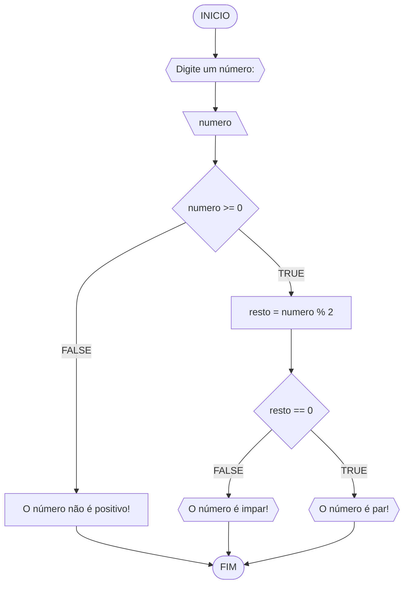
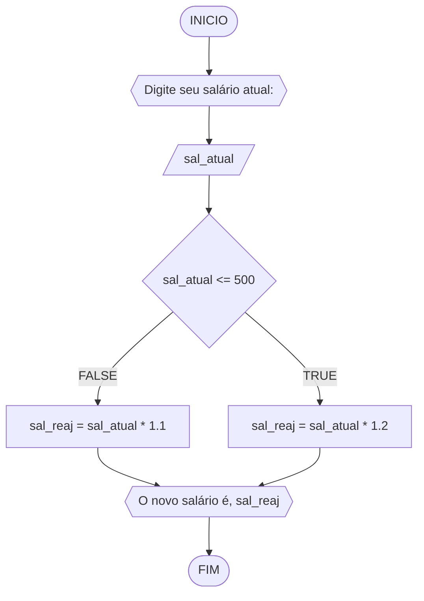
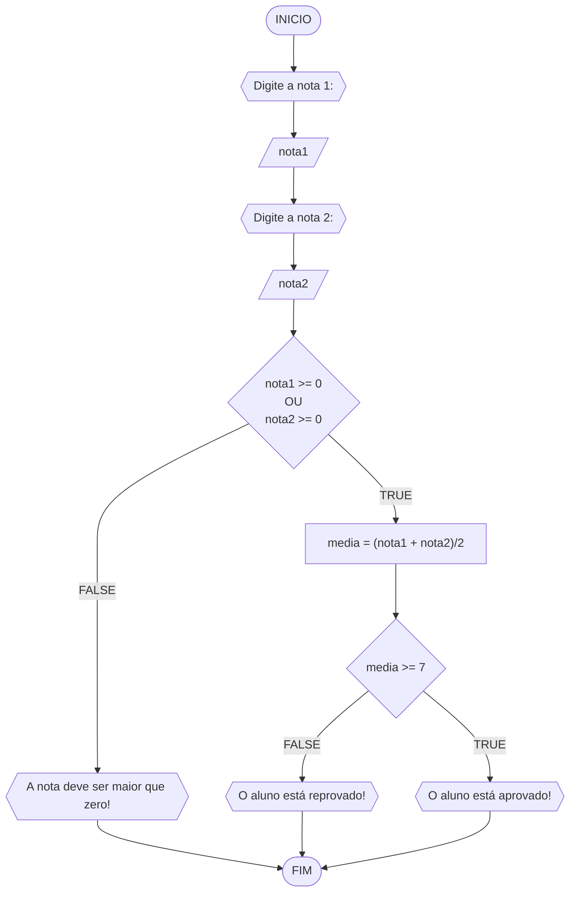
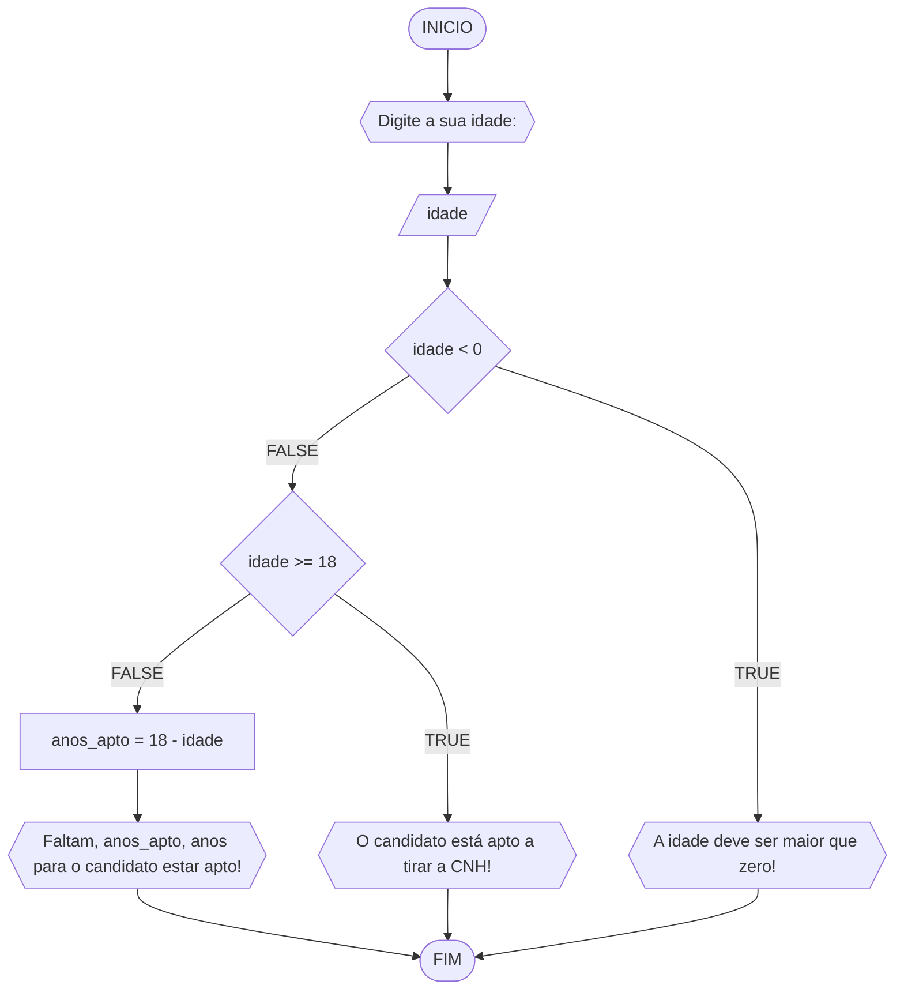

# UNIFOR
**Nome**: Nome do estudante <br>
**Disciplina**: Raciocínio lógico algorítmico

## Lista de exercícios 01

### Exercício 01 (1 ponto)
Represente, em fluxograma e pseudocódigo, um algoritmo para determinar se um número inteiro e positivo é par ou impar.

#### Fluxograma (0,25 ponto)



#### Pseudocódigo (0,5 ponto)
```java
1  ALGORTIMO verifica_par_impar
2  DECLARE numero, resto: INTEIRO
3  ESCREVA "Digite um número: "
4  INICIO
4  LEIA numero
5  SE numero >= 0 ENTAO                  // verifica se o inteiro é positivo
6    resto <- numero % 2                 // calcula o resto da divisão por 2
7    SE resto == 0 ENTAO                // verifica se o resto é igual a zero
8      ESCREVA "O número é par!"
9    SENAO
10     ESCREVA "O número é impar!"
11   FIM_SE
11  SENAO                                // caso inteiro for negativo (condição linha 5)
12    ESCREVA "O número deve ser postivo!"
13 FIM_SE
13 FIM
```

#### Tabela de testes (0,25 ponto)
| numero | numero >= 0 | resto | resto == 0 | Saída |
| -- | -- | -- | -- | -- | 
| -1 | F |   |   | "O número deve ser postivo!" |
| 0  | V | 0 | V | "O número é par!" |
| 13 | V | 1 | F | "O número é impar!" |
| 30 | V | 0 | V | "O número é par!" |

## Exercício 02 (3 pontos)
Represente, em fluxograma e pseudocódigo, um algoritmo para calcular o novo salário de um funcionário. 
Sabe-se que os funcionários que recebem atualmente salário de até R$ 500 terão aumento de 20%; os demais terão aumento de 10%.

#### Fluxograma (1.0 ponto)



#### Pseudocódigo (1.0 ponto)

```java
ALGORTIMO ReajusteSalario
DECLARE sal_atual, sal_reaj: REAL
ESCREVA "Digite seu salário atual:"
LEIA sal_atual
SE sal_atual <= 500 ENTAO
  sal_reaj = sal_atual * 1.2
SENAO
  sal_reaj = sal_atual * 1.1
FIM_SE
ESCREVA "O novo salário é R$", sal_reaj
FIM_ALGORITMO
```

#### Tabela de testes (1.0 ponto)

| sal_atual | sal_atual >= 500 |sal_reaj       | saída                   | 
| --        | --               | --            | --                      | 
| 400       | False            | 400*1.2 = 480 | O novo salário é R$ 480 |
| 500       | True             | 500*1.2 = 600 | O novo salário é R$ 600 |
| 600       | True             | 600*1.1 = 660 | O novo salário é R$ 660 |

## Exercício 03 (3 pontos)
Represente, em fluxograma e pseudocódigo, um algoritmo para calcular a média aritmética entre duas notas de um aluno e mostrar sua situação, que pode ser aprovado ou reprovado.

#### Fluxograma (1 ponto)



#### Pseudocódigo (1 ponto)

```java
ALGORTIMO SituacaoAluno
DECLARE nota1, nota2, media: REAL
ESCREVA "Digite a nota 1:"
LEIA nota1
ESCREVA "Digite a nota 2:"
LEIA nota2
SE nota1 >= 0 E nota2 >= 0 ENTAO  // condição para que as notas sejam maiores que zero
  media =  (nota1 + nota2)/2
  SE media >= 7 ENTAO
    ESCREVA "O aluno está aprovado!"
  SENAO
    "O aluno está reprovado!"
  FIM_SE
SENAO
  ESCREVA "A nota deve ser maior que zero!"
FIM_SE
FIM_ALGORITMO
```

#### Tabela de testes (1 ponto)

| nota1 | nota2 | nota1 >= 0 E nota2 >= 0 | media        | saĩda | 
| --    | --    | --                      | --           | --    | 
| -1    | 0     | False                   |              | A nota deve ser maior que zero! | 
| 0     | 0     | True                    | (0+0)/2 = 0  | O aluno está reprovado!|
| 4     | 8     | True                    | (4+8)/2 = 6  | O aluno está reprovado!|
| 4     | 10    | True                    | (4+10)/2 = 7 | O aluno está aprovado!|

## Exercício 04 (3 pontos)
Represente, em fluxograma e pseudocódigo, um algoritmo que, a partir da idade do candidato(a), determinar se pode ou não tirar a CNH. 
Caso não atender a restrição de idade, calcular quantos anos faltam para o candidato estar apto.

#### Fluxograma (1.0 ponto)



#### Pseudocódigo (1.0 ponto)

```java
1  ALGORTIMO AptoCNH
2  DECLARE idade, anos_apto: INTEIRO
3  ESCREVA ""Digite a sua idade:"
4  LEIA idade
5  SE idade < 0 ENTAO
6    ESCREVA "A idade deve ser maior que zero!"
7  SENAO
8    SE idade >= 18 ENTAO
9      ESCREVA "O candidato está apto a tirar a CNH!"
10   SENAO
11     anos_apto <- 18 - idade
12     ESCREVA "Faltam", anos_apto, "ano(s) para o candidato estar apto!"
13   FIM_SE
14 FIM_SE
15 FIM_ALGORITMO
```

#### Tabela de testes (1.0 ponto)

| idade | idade < 0 | idade >= 18 | anos_apto | saída                                         | 
| --    | --        | --          | --        | --                                            | 
| -1    | True      |             |           |                                               |
| 0     | False     | False       | 18-0 = 18 | Faltam 18 ano(s) para o candidato estar apto! |
| 17    | False     | False       | 18-17 = 1 | Faltam 1 ano(s) para o candidato estar apto!  |
| 18    | False     | True        |           | O candidato está apto a tirar a CNH!          |
