# L1

JOAO PEDRO MUNIZ 
## Lista de exercícios 01

### Exercício 01 (1 ponto)
Represente, em fluxograma e pseudocódigo, um algoritmo para determinar se um número inteiro e positivo é par ou impar.

#### Fluxograma (0,25 ponto)

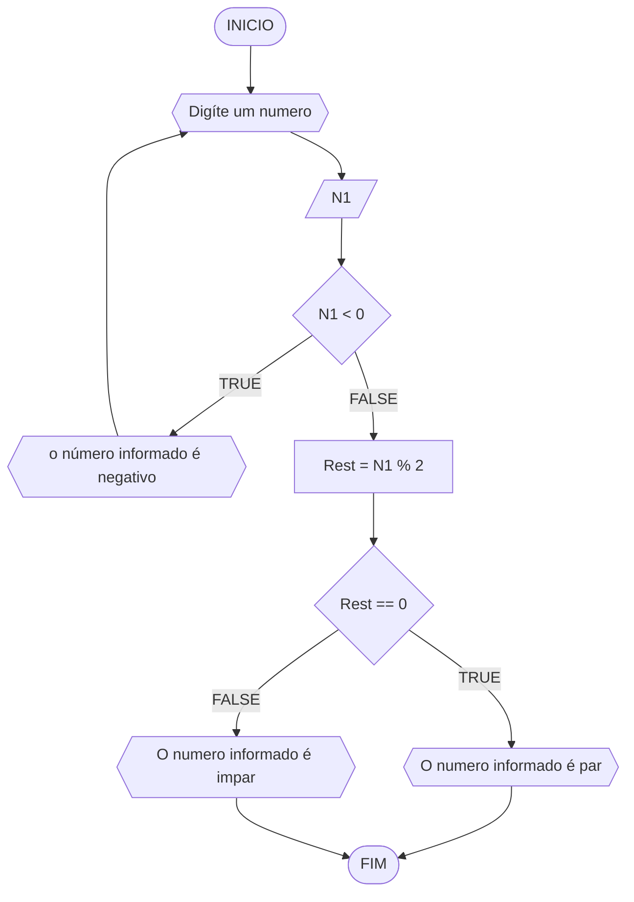
```mermaid
flowchart TD
A([INICIO]) --> B{{Digíte um numero}}
B --> C[/N1/]
C --> D{N1 < 0}
D --TRUE-->E{{o número informado é negativo}}
E -->B
D --FALSE-->F[Rest = N1 % 2]
F --> G{Rest == 0}
G --FALSE--> H{{O numero informado é impar}}
G --TRUE--> I{{O numero informado é par}}
I --> Z([FIM])
H --> Z
```

#### Pseudocódigo (0,5 ponto)
```
ALGORÍTIMO par_ou_impar
DECLARE N1, Rest: Int
INICIO
ESCREVA "Digite um número"
LEIA N1
ENQUANTO N1 < 0 FAÇA
	ESCREVA "O número informado é negativo"
FIM_ENQUANTO
Rest = N1 % 2
SE Rest == 0
	ESCREVA "O número informado é par"
SENÃO 
	ESCREVA "O número informado é impar"
FIM_SE
FIM_ALGORITIMO
```

#### Teste de mesa (0,25 ponto)
|N1|N1 < 0|Rest = N1 % 2|Rest == 0|Saída|
|--|--|--|--|--|
|7|F|1|F|O número informado é impar
|18|F|0|T|O número informado é par
|-72|V|-|-|O número informado é negativo
## Exercício 02 (3 pontos)
Represente, em fluxograma e pseudocódigo, um algoritmo para calcular o novo salário de um funcionário. 
Sabe-se que os funcionários que recebem atualmente salário de até R$ 500 terão aumento de 20%; os demais terão aumento de 10%.

#### Fluxograma (1.0 ponto)
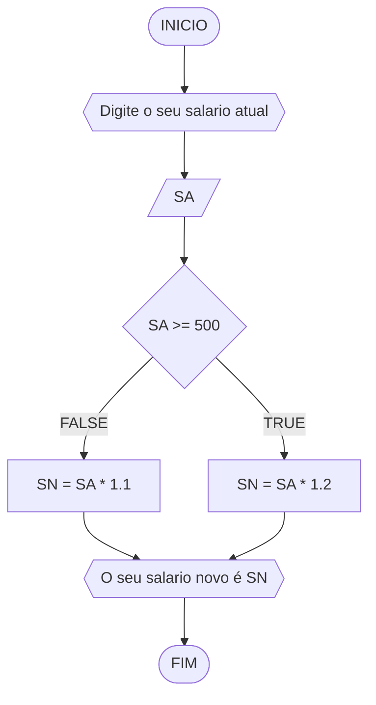
```mermaid
flowchart TD
A([INICIO]) --> B{{Digite o seu salario atual}}
B --> C[/SA/]
C --> D{SA >= 500}
D --FALSE--> E[SN = SA * 1.1]
D --TRUE--> F[SN = SA * 1.2]
E --> Z{{O seu salario novo é SN}}
F --> Z
Z --> Z1([FIM]) 
```

#### Pseudocódigo (1.0 ponto)

```
ALGORITIMO novo_salário
DECLARE SA, SN: Int
INICIO
ESCREVA "Digite o seu salário atual"
LEIA SA
SE SA > 500
	SN = SA * 1.1
SENÃO
	SN = SA * 1.2
FIM_SE
ESCREVA "O seu salário novo é", SN
FIM_ALGORÍTIMO
```

#### Teste de mesa (1.0 ponto)

|SA|SA >= 500|SN|SAÍDA|
|--|--|--|--|
|470|F|564|O seu salário novo é 564|
|550|V|605|O seu salário novo é 605|

## Exercício 03 (3 pontos)
Represente, em fluxograma e pseudocódigo, um algoritmo para calcular a média aritmética entre duas notas de um aluno e mostrar sua situação, que pode ser aprovado ou reprovado.

#### Fluxograma (1 ponto)

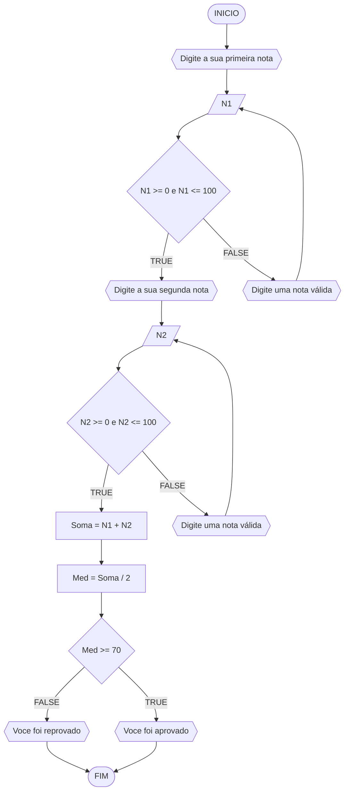
```mermaid
flowchart TD
A([INICIO]) --> B{{Digite a sua primeira nota}}
B --> C[/N1/]
C --> L{N1 >= 0 e N1 <= 100}
L --TRUE--> D{{Digite a sua segunda nota}}
L --FALSE--> M{{Digite uma nota válida}}
M --> C
D --> E[/N2/]
E --> N{N2 >= 0 e N2 <= 100}
N --TRUE--> F[Soma = N1 + N2]
F --> X[Med = Soma / 2]
X --> G{Med >= 70}
N --FALSE--> O{{Digite uma nota válida}}
O --> E
G --FALSE--> H{{Voce foi reprovado}}
G --TRUE--> I{{Voce foi aprovado}}
H --> Z
I --> Z([FIM])
```

#### Pseudocódigo (1 ponto)

```
Algoritmo ContaAprovacoes
DECLARE N1, N2, Med: Int
INICIO
ESCREVA "Digite a sua primeira nota"
LEIA N1
ENQUANTO N1 < 0 e N1 > 100 FAÇA
	ESCREVA "Digite uma nota válida"
	LEIA N1
FIM_ENQUANTO
ESCREVA "Digite a sua segunda nota"
LEIA N2 
ENQUANTO N2 < 0 e N2 > 100 FAÇA
	ESCREVA "Digite uma nota válida"
	LEIA N2
FIM_ENQUANTO
Med = (N1 + N2)/2
SE Med >= 70
	ESCREVA "Voce foi aprovado"
SENÃO
	ESCREVA "Voce foi reprovado"
FIM_SE
FIM_ALGORITIMO 
```

#### Teste de mesa (1 ponto)

|N1|N1 < 0 e N1 > 100|N2|N2 < 0 e N2 > 100|Med = (N1 + N2)/2|Med >= 70|Saída|
|--|--|--|--|--|--|--|
|100|F|60|F|80|V|Voce foi aprovado|
|60|F|70|F|65|F|Voce foi reprovado|
|-70|V|-|-|-|-|Digite uma nota válida|
|50|F|150|V|-|-|Digite uma nota válida|
## Exercício 04 (3 pontos)
Represente, em fluxograma e pseudocódigo, um algoritmo que, a partir da idade do candidato(a), determinar se pode ou não tirar a CNH. 
Caso não atender a restrição de idade, calcular quantos anos faltam para o candidato estar apto.

#### Fluxograma (1.0 ponto)

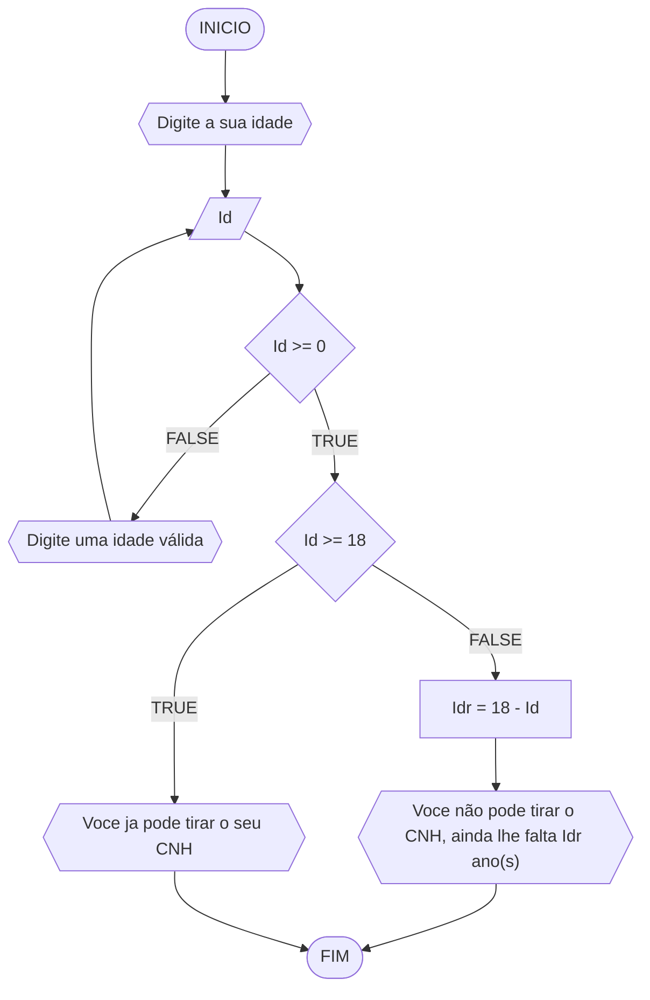
```mermaid
flowchart TD
A([INICIO]) --> B{{Digite a sua idade}}
B --> C[/Id/]
C --> D{Id >= 0}
D --FALSE--> E{{Digite uma idade válida}}
E --> C
D --TRUE--> F{Id >= 18}
F --FALSE--> G[Idr = 18 - Id]
G --> H{{"Voce não pode tirar o CNH, ainda lhe falta Idr ano(s)"}} 
F --TRUE--> I{{Voce ja pode tirar o seu CNH}}
H --> Z([FIM])
I --> Z
```


#### Pseudocódigo (1.0 ponto)

```
Algoritmo ContaAprovacoes
DECLARE Id, Idr: Int
INICIO
ESCREVA "Digite a sua idade"
LEIA Id
ENQUANTO Id < 0 FAÇA 
	ESCREVA "Digite uma idade valida"
	LEIA Id
FIM_ENQUANTO
SE Id >= 18
	ESCREVA "Voce ja pode tirar o seu CNH"
SENÃO
	Idr = 18 - Id
	ESCREVA "Voce não pode tirar o CNH, ainda lhe falta", Idr, "ano(s)"
FIM_SE
FIM_ALGORITMO
```

#### Teste de mesa (1.0 ponto)

|Id|Id < 0|Id >= 18|Idr = 18 - Id|Saída| 
|--|--|--|--|--| 
|17|F|F|1|Voce não pode tirar o CNH, ainda lhe falta 1 ano(s)|
|-9999999999999|V|-|-|Digite uma idade valida|
|19|F|V|-|Voce ja pode tirar o seu CNH
UNIFOR
Nome: Sergio de Paiva Ximenes Filho

Disciplina: Raciocinio lógico e Algorítimo

Lista de exercícios 01
Exercício 01 (1 ponto)
Represente, em fluxograma e pseudocódigo, um algoritmo para determinar se um número inteiro e positivo é par ou impar.

Fluxograma (0,25 ponto)
TRUE
FALSE
FALSE
TRUE
INICIO
Digíte um numero
N1
N1 < 0
o número informado é negativo
Rest = N1 % 2
Rest == 0
O numero informado é impar
O numero informado é par
FIM
Pseudocódigo (0,5 ponto)
ALGORÍTIMO par_ou_impar
DECLARE N1, Rest: Int
INICIO
ESCREVA "Digite um número"
LEIA N1
ENQUANTO N1 < 0 FAÇA
	ESCREVA "O número informado é negativo"
FIM_ENQUANTO
Rest = N1 % 2
SE Rest == 0
	ESCREVA "O número informado é par"
SENÃO 
	ESCREVA "O número informado é impar"
FIM_SE
FIM_ALGORITIMO
Teste de mesa (0,25 ponto)
N1	N1 < 0	Rest = N1 % 2	Rest == 0	Saída
7	F	1	F	O número informado é impar
18	F	0	T	O número informado é par
-72	V	-	-	O número informado é negativo
Exercício 02 (3 pontos)
Represente, em fluxograma e pseudocódigo, um algoritmo para calcular o novo salário de um funcionário.
Sabe-se que os funcionários que recebem atualmente salário de até R$ 500 terão aumento de 20%; os demais terão aumento de 10%.

Fluxograma (1.0 ponto)
FALSE
TRUE
INICIO
Digite o seu salaraio atual
SA
SA >= 500
SN = SA * 1.1
SN = SA * 1.2
O seu salario novo é SN
FIM
Pseudocódigo (1.0 ponto)
ALGORITIMO novo_salário
DECLARE SA, SN: Int
INICIO
ESCREVA "Digite o seu salário atual"
LEIA SA
SE SA >= 500
	SN = SA * 1.1
SENÃO
	SN = SA * 1.2
FIM_SE
ESCREVA "O seu salário novo é", SN
FIM_ALGORÍTIMO
Teste de mesa (1.0 ponto)
SA	SA >= 500	SN	SAÍDA
470	F	564	O seu salário novo é 564
550	V	605	O seu salário novo é 605
Exercício 03 (3 pontos)
Represente, em fluxograma e pseudocódigo, um algoritmo para calcular a média aritmética entre duas notas de um aluno e mostrar sua situação, que pode ser aprovado ou reprovado.

Fluxograma (1 ponto)
TRUE
FALSE
TRUE
FALSE
FALSE
TRUE
INICIO
Digite a sua primeira nota
N1
N1 >= 0 e N1 <= 100
Digite a sua segunda nota
Digite uma nota válida
N2
N2 >= 0 e N2 <= 100
Soma = N1 + N2
Med = Soma / 2
Med >= 70
Digite uma nota válida
Voce foi reprovado
Voce foi aprovado
FIM
Pseudocódigo (1 ponto)
Algoritmo ContaAprovacoes
DECLARE N1, N2, Med: Int
INICIO
ESCREVA "Digite a sua primeira nota"
LEIA N1
ENQUANTO N1 < 0 e N1 > 100 FAÇA
	ESCREVA "Digite uma nota válida"
	LEIA N1
FIM_ENQUANTO
ESCREVA "Digite a sua segunda nota"
LEIA N2 
ENQUANTO N2 < 0 e N2 > 100 FAÇA
	ESCREVA "Digite uma nota válida"
	LEIA N2
FIM_ENQUANTO
Med = (N1 + N2)/2
SE Med >= 70
	ESCREVA "Voce foi aprovado"
SENÃO
	ESCREVA "Voce foi reprovado"
FIM_SE
FIM_ALGORITIMO 
Teste de mesa (1 ponto)
N1	N1 < 0 e N1 > 100	N2	N2 < 0 e N2 > 100	Med = (N1 + N2)/2	Med >= 70	Saída
100	F	60	F	80	V	Voce foi aprovado
60	F	70	F	65	F	Voce foi reprovado
-70	V	-	-	-	-	Digite uma nota válida
50	F	150	V	-	-	Digite uma nota válida
Exercício 04 (3 pontos)
Represente, em fluxograma e pseudocódigo, um algoritmo que, a partir da idade do candidato(a), determinar se pode ou não tirar a CNH.
Caso não atender a restrição de idade, calcular quantos anos faltam para o candidato estar apto.

Fluxograma (1.0 ponto)
FALSE
TRUE
FALSE
TRUE
INICIO
Digite a sua idade
Id
Id >= 0
Digite uma idade válida
Id >= 18
Idr = 18 - Id
Voce não pode tirar o CNH, ainda lhe falta Idr ano(s)
Voce ja pode tirar o seu CNH
FIM
Pseudocódigo (1.0 ponto)
Algoritmo ContaAprovacoes
DECLARE Id, Idr: Int
INICIO
ESCREVA "Digite a sua idade"
LEIA Id
ENQUANTO Id < 0 FAÇA 
	ESCREVA "Digite uma idade valida"
	LEIA Id
FIM_ENQUANTO
SE Id >= 18
	ESCREVA "Voce ja pode tirar o seu CNH"
SENÃO
	Idr = 18 - Id
	ESCREVA "Voce não pode tirar o CNH, ainda lhe falta", Idr, "ano(s)"
FIM_SE
FIM_ALGORITMO
Teste de mesa (1.0 ponto)
Id	Id < 0	Id >= 18	Idr = 18 - Id	Saída
17	F	F	1	Voce não pode tirar o CNH, ainda lhe falta 1 ano(s)
-9999999999999	V	-	-	Digite uma idade valida
19	F	V	-	Voce ja pode tirar o seu CNH

# L2


# UNIFOR
**Nome**: JOAO PEDRO MUNIZ
**Disciplina**: Raciocínio Lógico e Algorítmo
feita com auxilio de Sérgio de Paiva

## Exercício exemplo
Represente, em fluxograma e pseudocódigo, um algoritmo para calcular o adicional de salário de funcionário por cargo de uma empresa fictícia. Sabe-se que os funcionários de cargo técnico receberão reajuste de 50%, cargo de gerência, um reajuste de 30% e demais, um reajuste de 10%. 

#### Fluxograma
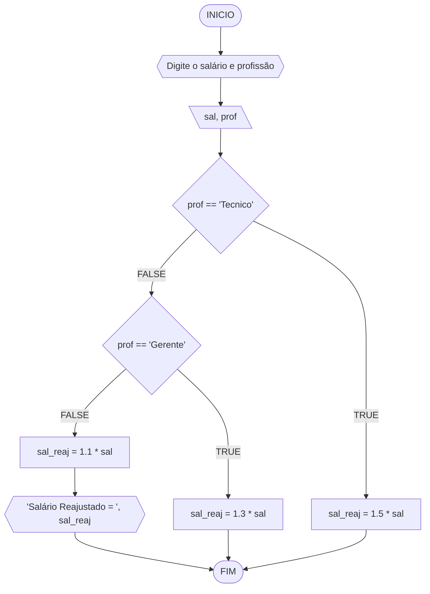
```mermaid
flowchart TD
A([INICIO]) --> B{{Digite o salário e profissão}}
B --> C[\sal, prof\]
C --> D{prof == 'Tecnico'}
D --FALSE--> E{prof == 'Gerente'}
D --TRUE--> F[sal_reaj = 1.5 * sal]
E --FALSE--> H[sal_reaj = 1.1 * sal]
E --TRUE--> G[sal_reaj = 1.3 * sal]
G --> I([FIM])
F --> I
H --> J{{'Salário Reajustado = ', sal_reaj}}
J --> I
```

#### Pseudocódigo
```
1  ALGORITMO calReajuste
2  DECLARE  sal, sal_reaj: real, prof: caractere
3  INICIO
4  LEIA sal, prof
5  ESCOLHA
6   CASO prof == “Técnico”		// caso 1
7     sal_reaj ← 1.5 * sal
8   CASO prof = “Gerente”		// caso 2
9     sal_reaj ← 1.3 * sal
10  SENÃO
11    sal_reaj ← 1.1 * sal
12 FIM_ESCOLHA
13 ESCREVA “Salário Reajustado = “, sal_reaj
14 FIM
```

#### Teste
| sal | prof | prof == “Técnico” | prof = “Gerente” | sal_reaj | Saída |
| -- | -- | -- | -- | -- | -- |
| 1000 | Técnico | V | F | 1500 | “Salário Reajustado = 1500“ |
| 2000 | Gerente | F | V | 2600 | “Salário Reajustado = 2600“ |
| 9000 | Diretor | F | F | 9900 | “Salário Reajustado = 9900“ |

## Lista de exercícios 02

### Exercício 01 (2.5 pontos)
Calcule a média de quatro números inteiros dados.

#### Fluxograma (1.0 ponto)

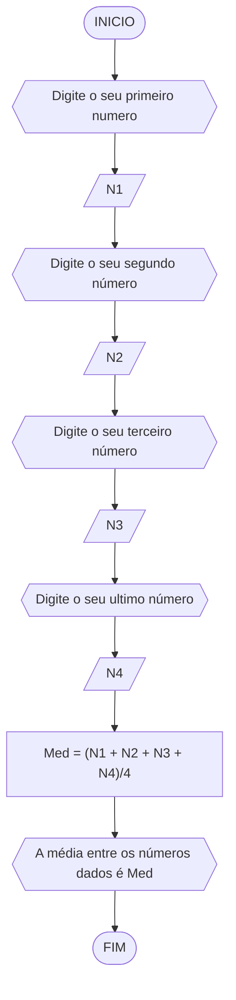
```mermaid
flowchart TD
A([INICIO]) --> B{{Digite o seu primeiro numero}}
B --> C[/N1/]
C --> D{{Digite o seu segundo número}}
D --> E[/N2/]
E --> F{{Digite o seu terceiro número}}
F --> G[/N3/]
G --> H{{Digite o seu ultimo número}}
H --> I[/N4/]
I --> J["Med = (N1 + N2 + N3 + N4)/4"]
J --> K{{A média entre os números dados é Med}}
K --> L([FIM])
```

#### Pseudocódigo (1.0 ponto)

```
Algoritmo Media
DECLARE N1, N2, N3, N4: int
	Med: float
INICIO
ESCREVA "Digite o seu primeiro número"
LEIA N1
ESCREVA "Digite o seu segundo número"
LEIA N2
ESCREVA "Digite o seu terceiro número"
LEIA N3
ESCREVA "Digite o seu ultimo número"
LEIA N4
Med = (N1 + N2 + N3 + N4)/4
ESCREVA "A média dos números dados é", Med
FIM_ALGORITMO
```

#### Teste de mesa (0.5 ponto)

|N1|N2|N3|N4|Med = (N1 + N2 + N3 + N4)/4|Saída| 
|--|--|--|--|--|--|
|-80|97|45|-3|-7.25|A média dos números dados é Med|


### Exercício 02 (2.5 pontos)
Leia uma temperatura dada em Celsius (C) e imprima o equivalente em Fahrenheit (F). (Fórmula de conversão: F = (9/5) * C + 32)

#### Fluxograma (1.0 ponto)

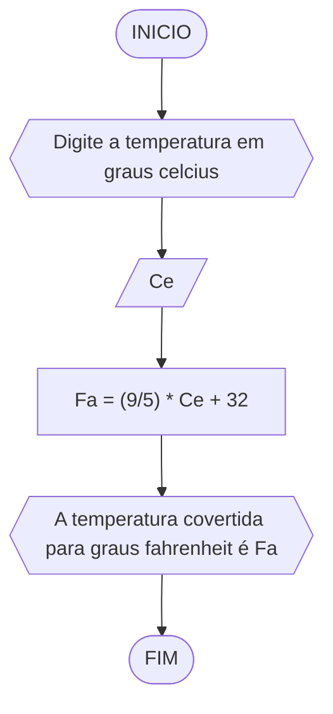
```mermaid
flowchart TD
A([INICIO]) --> B{{Digite a temperatura em graus celcius}}
B --> C[/Ce/]
C --> D["Fa = (9/5) * Ce + 32"]
D --> E{{A temperatura covertida para graus fahrenheit é Fa}}
E --> F([FIM])
```

#### Pseudocódigo (1.0 ponto)

```
Algoritmo ConverteCelsiusFarenheit
DECLARE Ce, Fe: float
INICIO
ESCREVA "Digite a temperatura em graus celcius"
LEIA Ce
Fa = (9/5) * Ce + 32
ESCREVA "A temperatura covertida para graus fahrenheit é", Fa
FIM_ALGORITMO
```

#### Teste de mesa (0.5 ponto)

|Ce|Fa = (9/5) * Ce + 32|Saída|
|--|--|--| 
|0|32|A temperatura covertida para graus fahrenheit é 32|

### Exercício 03 (2.5 pontos)
Receba dois números reais e um operador e efetue a operação correspondente com os valores recebidos (operandos). 
O algoritmo deve retornar o resultado da operação selecionada simulando todas as operações de uma calculadora simples.

#### Fluxograma (1.0 ponto)

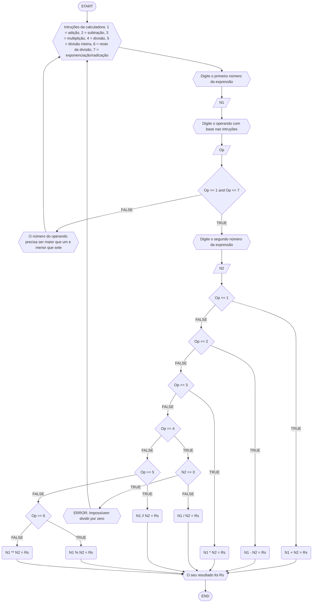
```mermaid
flowchart TD
A([START]) --> B{{Intruções da calculadora: 1 = adição, 2 = subtração, 3 = multiplição, 4 = divisão, 5 = divisão inteira, 6 = resto da divisão, 7 = exponenciação/radicação}}
B-->C{{Digite o primeiro número da expressão}}
C-->D[/N1/]
D-->E{{Digite o operando com base nas intruções}}
E-->F[/Op/]
F-->G{Op >= 1 and Op <= 7}
G--FALSE-->H{{O número do operando precisa ser maior que um e menor que sete}}
H-->B
G--TRUE-->I{{Digite o segundo número da expressão}}
I-->J[/N2/]
J-->K{Op == 1}
K--FALSE-->L{Op == 2}
K--TRUE-->k(N1 + N2 = Rs)
k-->R
L--FALSE-->M{Op == 3}
L--TRUE-->l(N1 - N2 = Rs)
l-->R
M--FALSE-->N{Op == 4}
M--TRUE-->m(N1 * N2 = Rs)
m-->R
N--FALSE-->O{Op == 5}
N--TRUE-->n{N2 == 0}
n--FALSE-->n2(N1 / N2 = Rs)
n--TRUE-->n3{{ERROR: Impossívem dividir por zero}}
n2-->R
n3-->B
O--FALSE-->P{Op == 6}
O--TRUE-->o(N1 // N2 = Rs)
o-->R
P--FALSE-->q
P--TRUE-->p(N1 % N2 = Rs)
p-->R
q(N1 ** N2 = Rs)
q-->R{{O seu resultado foi Rs}}
R-->Z([END])
```

#### Pseudocódigo (1.0 ponto)

```
 Algoritimo Calculadora
 DECLARE N1,N2,Rs: float
	 Op: int
 INICIO
 ESCREVA "Intruções da calculadora: 1 = adição, 2 = subtração, 3 = multiplição, 4              
	  = divisão, 5 = divisão inteira, 6 = resto da divisão, 7 = exponenciação/radicação" 
 ESCREVA "Digite o primeiro número da expressão"
 LEIA N1
 ESCREVA "Digite o operando com base nas intruções"
 LEIA Op
 SE Op >= 1 e Op <= 7
	ESCREVA "Digite o segundo número da expressão"
	LEIA N2
	ESCOLHA
		CASO Op =  1
			Rs = N1 + N2
		CASO Op =  2
			Rs = N1 - N2
		CASO Op = 3
			Rs = N1 * N2
		CASO Op = 4
		        ENQUANTO N2 == 0 FAÇA
				ESCREVA "ERROR: impossível dividir por zero, digite um novo denominador"
				LEIA N2
			FIM_ENQUANTO
			Rs = N1 / N2
		CASO Op = 5
			ENQUANTO N2 == 0 FAÇA
				ESCREVA "ERROR: impossível dividir por zero, digite um novo denominador"
				LEIA N2
			FIM_ENQUANTO
			Rs = N1 // N2
		CASO Op = 6
			Rs = N1 % N2
		SENÃO
 			Rs = N1 ** N2   
	FIM_ESCOLHA 
ESCREVA "O seu resultado foi", Rs    
FIM_ALGORÍTIMO
```

#### Teste de mesa (0.5 ponto)

|N1|Op|N2|Op == 1|Op == 2|Op == 3|Op == 4|N2 == 0|Op == 5|N2 == 0|Op == 6|Rs|Saída| 
|--|--|--|--|--|--|--|--|--|--|--|--|--|
|8|1|10|V|-|-|-|-|-|-|-|18|O seu resultado foi 18|
|20|2|20|F|V|-|-|-|-|-|-|0|O seu resultado foi 0|
|87|3|0|F|F|V|-|-|-|-|-|0|O seu resultado foi 0|
|0.2|4|0.1|F|F|F|V|F|-|-|-|2|O seu resultado foi 2|
|120|4|0|F|F|F|V|V|-|-|-|-|ERROR: impossível dividir por zero, digite um novo denominador|
|25|5|7|F|F|F|F|-|V|F|-|3|O seu resultado foi 3|
|37|5|0|F|F|F|F|-|V|V|-|-|ERROR: impossível dividir por zero, digite um novo denominador|
|31|6|2|F|F|F|F|-|F|-|V|1|O seu resultado é 1|
|2|7|5|F|F|F|F|-|F|-|F|32|O seu resultado é 32|


### Exercício 04 (2.5 pontos)
Elaborar um algoritmo que, dada a idade, classifique nas categorias: infantil A (5 - 7 anos), infantil B (8 -10 anos), juvenil A (11 - 13 anos), juvenil B (14 -17 anos) e adulto (maiores que 18 anos).

#### Fluxograma (1.0 ponto)

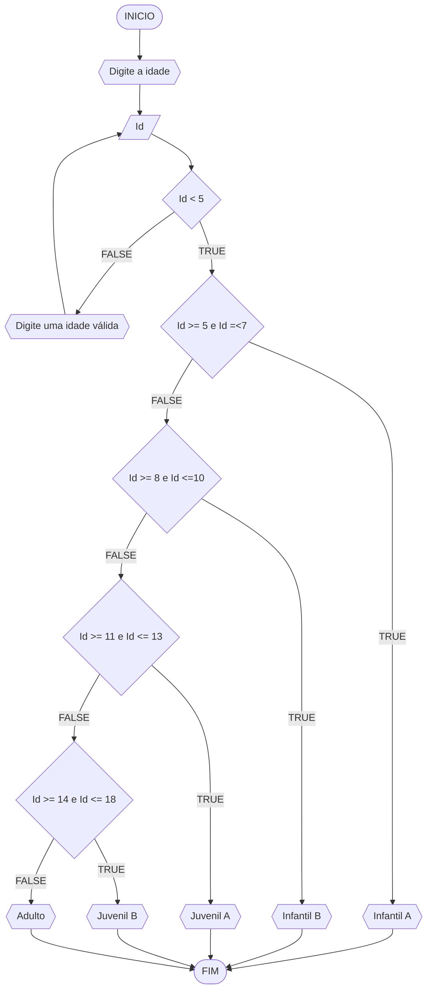
```mermaid
flowchart TD
A([INICIO]) --> B{{Digite a idade}}
B --> C[/Id/]
C --> D{Id < 5}
D --FALSE--> E{{Digite uma idade válida}}
E --> C
D --TRUE--> F{Id >= 5 e Id =<7}
F --FALSE--> G{Id >= 8 e Id <=10}
G --FALSE--> H{Id >= 11 e Id <= 13}
H --FALSE--> I{Id >= 14 e Id <= 18}
F --TRUE--> J{{Infantil A}}
G --TRUE--> K{{Infantil B}}
H --TRUE--> L{{Juvenil A}}
I --TRUE--> M{{Juvenil B}}
I --FALSE--> N{{Adulto}}
J --> Z([FIM])
K --> Z
L --> Z
M --> Z
N --> Z
```

#### Pseudocódigo (1.0 ponto)
```
Algoritmo ClassificaCategoria
DECLARE Id: int
INICIO
ESCREVA "Digite a idade"
LEIA Id
ENQUANTO Id < 5 FAÇA
	ESCREVA "Digite uma idade válida"
	LEIA Id
ESCOLHA
	CASO Id >= 5 e Id <= 7
		ESCREVA "Infantil A"
	CASO Id >= 8 e Id <=10
		ESCREVA "Infantil B"
	CASO Id >= 11 e Id <= 13
		ESCREVA "juvenil A"
	CASO Id >= 14 e Id <= 17
		ESCREVA "Juvenil B"
SENAO
	ESCREVA "Adulto"
FIM_ESCOLHA 
FIM_ALGORITMO
```

#### Teste de mesa (0.5 ponto)


|Id|Id < 5|Id >= 5 e Id <= 7|Id >= 8 e Id <= 10|Id >= 11 e Id <= 13|Id >= 14 e Id <= 17|Saida|
|--|--|--|--|--|--|--|
|-5|V|-|-|-|-|Digite uma idade valida|
|5|F| V|-|-|-|Infantil A|
|9|F| F|V|-|-|Infantil B|
|11|F|F|F|V|-|Juvenil A|
|17|F|F|F|F|V|Juvenil B|
|24|F|F|F|F|F|Adulto|

# L3
# UNIFOR
**Nome**: JOAO PEDRO MUNIZ 
**Disciplina**: Raciocínio lógico algorítmico

## Exercício exemplo 1
Implemente e teste um programa que imprima os n primeiros números.

#### Fluxograma
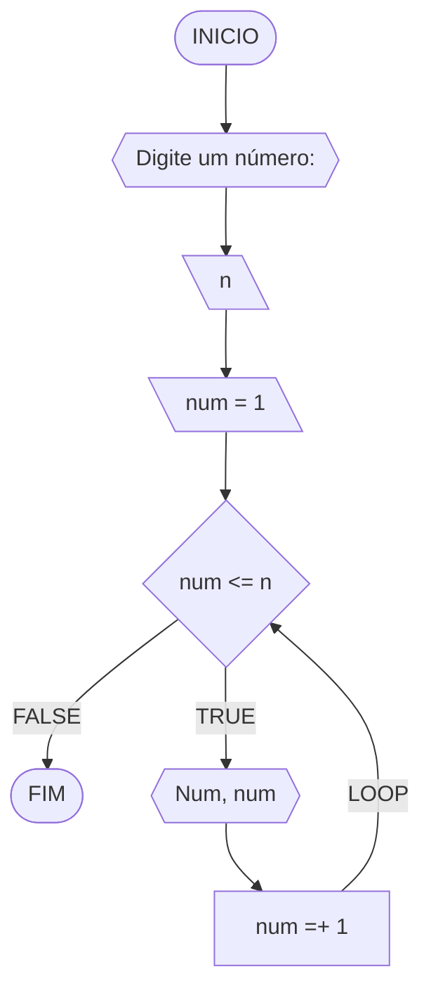
```mermaid
flowchart TD
A([INICIO]) --> B{{Digite um número: }}
B --> C[\n\]
C --> D[\num = 1\]
D --> E{num <= n}
E --FALSE--> I([FIM])
E --TRUE--> F{{"Num", num}}
F --> G[num =+ 1]
G --LOOP--> E
```

#### Pseudocódigo
```
1 ALGORITMO print_n_primeiros
2 DECLARE n, num: INTEIRO
3 INICIO
4 ESCREVA “Digite um número: ”
4 LEIA n			// variável de entrada n
4 num ← 1			// variável num inicializada
5 ENQUANTO num <= n FAÇA	// n iterações
7	ESCREVA “Número ”, num
8	num ← num + 1		// num =+ 1 (incremento)
8 FIM_ENQUANTO
9 FIM
```

#### Teste de mesa
| it | n  | num | num <= n | Saída      | num =+ 1 |
| -- | -- | --  | --       | --         | --       |
| 1  | 10 | 1   | True     | Número 1   | 2        |
| 2  | 10 | 2   | True     | Número 2   | 3        |
| 3  | 10 | 3   | True     | Número 3   | 4        |
| 4  | 10 | 4   | True     | Número 4   | 5        |
| 5  | 10 | 5   | True     | Número 5   | 6        |
| 6  | 10 | 6   | True     | Número 6   | 7        |
| 7  | 10 | 7   | True     | Número 7   | 8        |
| 8  | 10 | 8   | True     | Número 8   | 9        |
| 9  | 10 | 9   | True     | Número 9   | 10       |
| 10 | 10 | 11  | True     | Número 10  | 11       |
| 11 | 10 | 11  | False    |            |          |

## Exercício exemplo 2
Implemente e teste um programa que some os n primeiros números.

#### Fluxograma
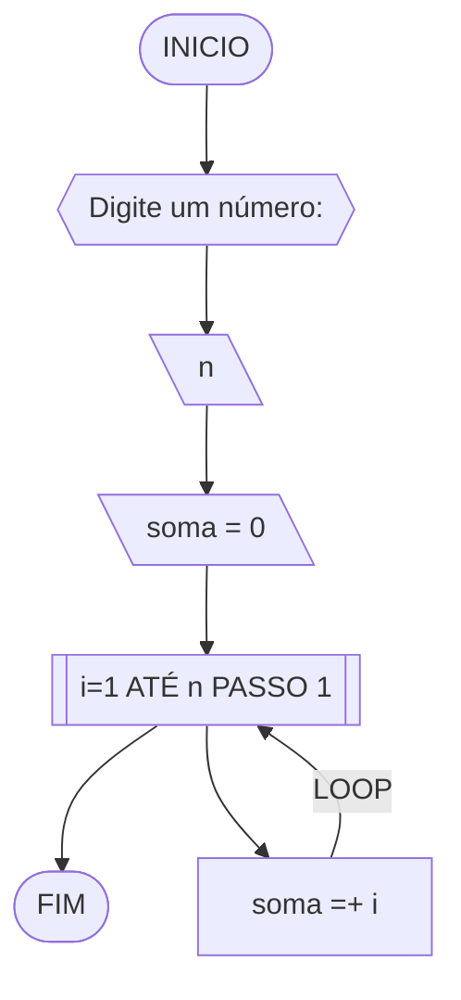
```mermaid
flowchart TD
A([INICIO]) --> B{{Digite um número: }}
B --> C[\n\]
C --> D[\soma = 0\]
D --> E[[i=1 ATÉ n PASSO 1]]
E --> G([FIM])
E --> F[soma =+ i]
F --LOOP--> E
```

#### Pseudocódigo
```
1  ALGORITMO	soma_n_numeros()
2  DECLARE	n, i, soma: INTEIRO
3  INICIO
4  ESCREVA “Digite a quantidade de números: ”
5  LEIA n		// variável de entrada n
7  soma ← 0		// variável soma inicializada
6  PARA i DE 1 ATÉ n PASSO 1 FAÇA
7	soma ← soma + i	// soma =+ i (incremento)
8  FIM_PARA
9  ESCREVA “A soma é igual a ”, soma
10 FIM
```

#### Teste de mesa
| it | n  | soma | i  | soma =+ i |
| -- | -- | --   | -- | --        |
| 1  | 10 | 0    | 1  | 1         |
| 2  | 10 | 1    | 2  | 3         |
| 3  | 10 | 3    | 3  | 6         |
| 4  | 10 | 6    | 4  | 10        |
| 5  | 10 | 10   | 5  | 15        |
| 6  | 10 | 15   | 6  | 21        |
| 7  | 10 | 21   | 7  | 28        |
| 8  | 10 | 28   | 8  | 36        |
| 9  | 10 | 36   | 9  | 45        |
| 10 | 10 | 45   | 10 | 55        | 

## Lista de exercícios 03

### Exercício 01 (2.5 pontos)
Atualize o algoritmo para determinar se um número inteiro e positivo é par ou ímpar, usando uma laço condicional para aceitar apenas números maiores ou iguais a zero. 

#### Fluxograma (1.0 ponto)

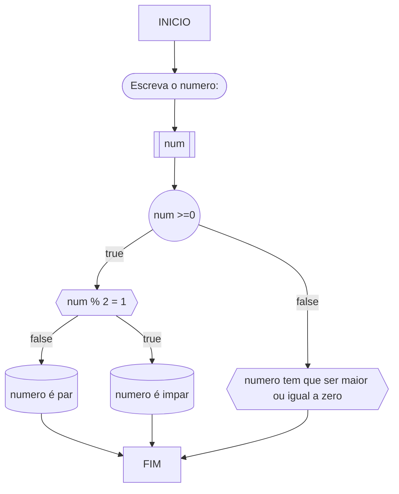
```mermaid
graph
INICIO-->a([Escreva o numero:])
a-->b[[num]]
b-->c((num >=0))
c--false-->d{{numero tem que ser maior ou igual a zero}}
c--true-->e{{num % 2 = 1}}
e--true-->f[(numero é impar)]
e--false-->A[(numero é par)]
A-->FIM
f-->FIM
d-->FIM
```

#### Pseudocódigo (1.0 ponto)

```
Algoritmo_parimpar
DECLARE num INTEIRO
SE num >=0
	ENTAO
		SE num % 2 = 1
			ENTAO
				ESCREVA "numero impar"
			SENAO
				ESCREVA "numero par"
	SENAO
		ESCREVA "numero tem que ser maior ou igual a zero"

```

#### Teste de mesa (0.5 ponto)

| num          |    num >=0   | num%2=1      | saida        
|      --      |      --      |      --      |      --     
| 7            | true         | true         |  numero impar
| -1           | false        |  ---         | numero tem que ser >=0
|10            | true         | false        | numero par


### Exercício 02 (2.5 pontos)
Faça um algoritmo que exiba na tela uma contagem de 0 até 30, exibindo apenas os múltiplos de 3.

#### Fluxograma (1.0 ponto)

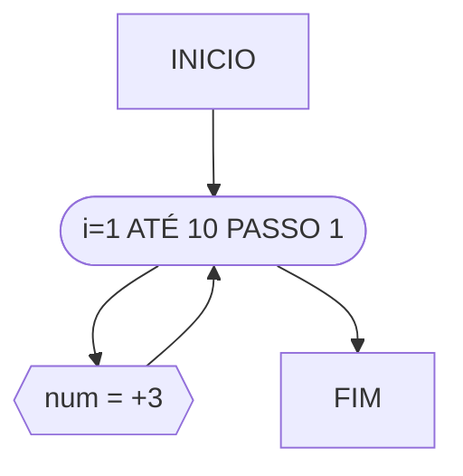
```mermaid
flowchart TD
INICIO-->a([i=1 ATÉ 10 PASSO 1])
a-->b{{num = +3}}
b-->a
a-->FIM
```

#### Pseudocódigo (1.0 ponto)

```
Algoritmo_30
DECLARE num ,i INTEIRO
PARA i DE 1 ATE 10 PASSO 1 FAÇA
	num = +3
FIM

```

#### Teste de mesa (0.5 ponto)

|  i           | num=+3       | i = 10       |    saida     | 
|      --      |      --      |      --      |      --      |
|1             | 3            | false        | 3
|2             | 6            | false        | 6
|10            | 30           | true         | 30


### Exercício 03 (2.5 pontos)
Dada uma sequência de números inteiros, calcular a sua soma. 
Por exemplo, para a sequência {12, 17, 4, -6, 8, 0}, o seu programa deve escrever o número 35.

#### Fluxograma (1.0 ponto)

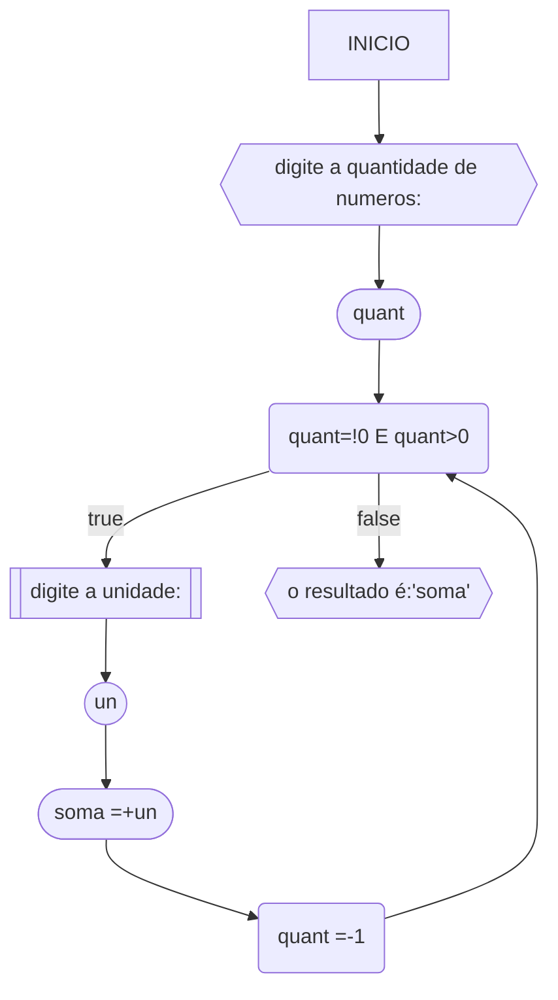
```mermaid
flowchart TD
INICIO-->a{{digite a quantidade de numeros:}}
a-->b([quant])
b-->c(quant=!0 E quant>0)
c--true-->d[[digite a unidade:]]
d-->e((un))
e-->f([soma =+un])
f-->A(quant =-1)
A-->c
c--false-->B{{o resultado é:'soma'}}
```

#### Pseudocódigo (1.0 ponto)

```
Algoritmo_soma
DECLARE quant ,un ,soma INTEIROS
ESCREVA "digite a quantidade de numeros:"
LEIA quant
ENQUANTO quant =! 0 OU quant > 0 FAÇA
	ESCREVA "digite a unidade:"
	LEIA un 
	soma =+un
	quant =-1
FIM_ENQUANTO
ESCREVA "o resultado é:'soma'"
FIM

```

#### Teste de mesa (0.5 ponto)

| quant        | quant =!0    | quant >0     | un           | soma +un     |saida 
|      --      |      --      |      --      |      --      |      --      | --
| 2            | true         | true         |  10          | 10           |- - -
| 1            |   true       | true         | 20           | 30           |- - - 
|0             | false        | false        |- - -         |- - -| o resultado é :'30'

### Exercício 04 (2.5 pontos)
Escreva um programa que leia a nota de diversos alunos, até que seja digitada uma nota negativa. 
Nesse momento, ele mostra a média aritmética de todas as notas lidas e quantas notas foram lidas. 
Ex. Foram lidas 14 notas. A média aritmética é 6.75!

#### Fluxograma (1.0 ponto)

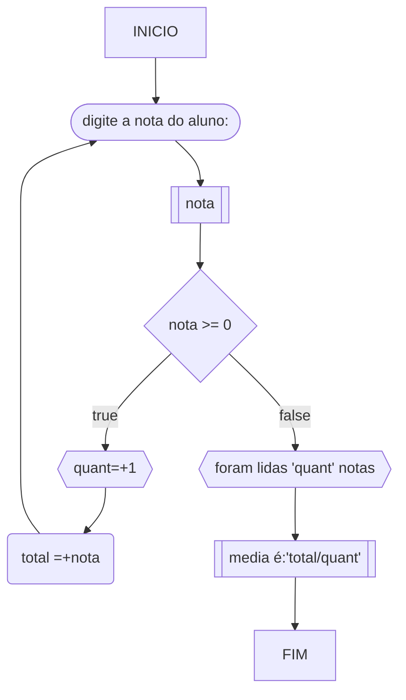
```mermaid
flowchart TD
INICIO-->a([digite a nota do aluno:])
a-->b[[nota]]
b-->c{nota >= 0}
c--true-->d{{quant=+1}}
d-->e(total =+nota)
e-->a
c--false-->f{{foram lidas 'quant' notas}}
f-->A[[media é:'total/quant']]
A-->FIM
```

#### Pseudocódigo (1.0 ponto)

```
Algoritmo_media
DECLARE nota ,quant ,total INTEIROS
nota<--0
ENQUANTO nota >= 0 FAÇA
	ESCREVA "digite a nota:"
	LEIA nota
	quant=+1
	total=+nota
FIM_ENQUANTO
ESCREVA "foram lidas 'quant' notas
ESCREVA "a media é:'total/quant'"
FIM
```

#### Teste de mesa (0.5 ponto)

| nota         | quant=+1     | total=+nota  | saida1       | saida2       | 
|      --      |      --      |      --      |      --      |      --      | 
|10            | 1            |  10          | - - -        |- - -
|4             | 2            | 14           |- - -         |- - -
|-1            | - - -        | - - -        |notas lidas:2 |media é: 7    


# AD1


# TRABALHO AD1
## Questão 1

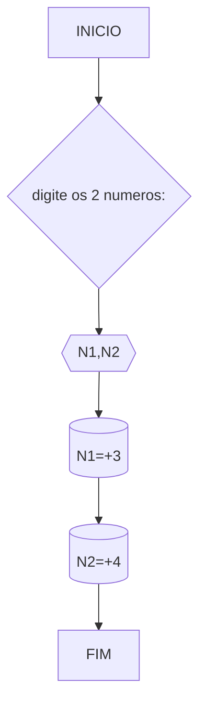
```mermaid
graph
INICIO-->a{digite os 2 numeros:}
a-->b{{N1,N2}}
b-->c[(N1=+3)]
c-->A[(N2=+4)]
A-->FIM

```
```
ALGORITIMO_troca_valores
DECLARE N1, N2 INTEIROS
ESCREVA "digite os 2 números":
LEIA N1, N2
N1 <- N1+3
N2 <- N2+4
FIM 

```

| N1 | N2 | N1=+3|N2=+4|
|--  |--  |--    |--   |   
|5   |6   |  8   |10   |
|0   |0   |  3   | 4   | 
|3   |3   |6     | 7   |  


# Questão 2


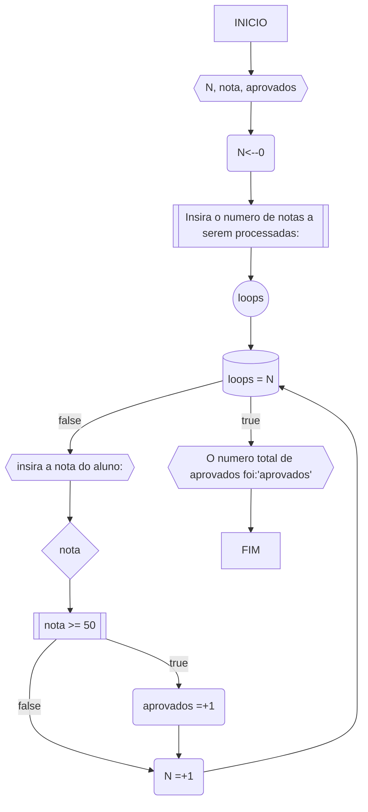
```mermaid
graph
INICIO-->c{{N, nota, aprovados}}
O-->a[[Insira o numero de notas a serem processadas:]]
a-->b((loops))
b-->d[(loops = N)]
d--true-->e{{O numero total de aprovados foi:'aprovados'}}
d--false-->f{{insira a nota do aluno:}}
f-->A{nota}
A-->B[[nota >= 50]]
B--true-->C(aprovados =+1)
B--false-->D(N =+1)
C-->D-->d
e-->FIM
c-->O(N<--0)
      

```
```
ALGORITIMO_aprovações
DECLARE N, nota , aprovados, loops  INTEIROS
ESCREVA "Insira o numero de notas a serem processadas:"
LEIA loops
N<--0
ENQUANTO N =! loops FAÇA
		ESCREVA "insira a nota do aluno:"
		LEIA nota
			SE nota >= 50
				ENTAO 
					aprovados =+1
			N =+1
ESCREVA "O numero total de aprovados foi:'aprovados'"			
FIM
```

N=loops| loops | N  | aprovados| nota| repetições
|--    |--     |--  |--        |--    |--   
false|3       |0   |0         |60    |0
false|3       |1   |1         | 40   |1
false|3       |2   |1         |100   |2
true |3       |3   |2         |---   |3


# Questão 3
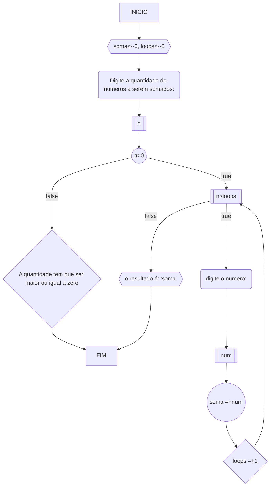
```mermaid
graph
INICIO-->a{{soma<--0, loops<--0}}
a-->b(Digite a quantidade de numeros a serem somados:)
b-->c[[n]]
c-->d((n>0))
d--true-->e
d--false-->G{A quantidade tem que ser maior ou igual a zero}
G-->FIM
e[[n>loops]]--false-->f{{o resultado é: 'soma'}}-->FIM
e--true-->T(digite o numero:)-->A[[num]]-->B((soma =+num))-->N{loops =+1}-->e


```

```ALGORITMO_soma
DECLARE soma, loops, n, num INTEIROS
soma<--0, loops<--0
ESCREVA "digite a quantidade de numeros a serem somados:"
LEIA n
SE n>0
	ENTÃO 
		ESCREVA "a quantidade tem que ser maior ou igual a zero"
	SENAO 
	ENQUANTO n>loops FAÇA
		ESCREVA "digite o numero:"
		LEIA num
		soma <-+num
		loops<-+1
FIM ENQUANTO	
FIM
```
|n     |n>0  | num    | soma=+num| loops=+1  |repetições| n>loops    
|--    |--   |--      |--        |--         |--        |--
|-1    |false| --     | --       |--         |--        |--
|2     |true |4      |4          |1          |1         |true
|2     |true |5      | 9         |2          |2         |false

# Questão 4

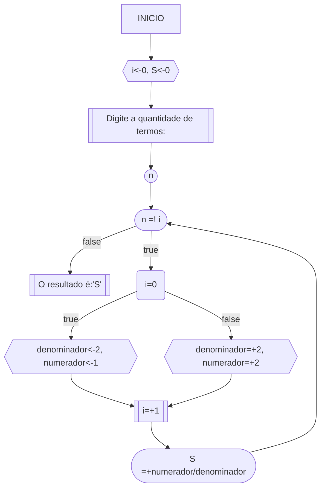
```mermaid
graph
INICIO-->a{{i<-0, S<-0 }}
a-->A[[Digite a quantidade de termos:]]
A-->b((n))
b-->B([n =! i])
B--false-->P[[O resultado é:'S']]
B--true-->c(i=0)
c--true-->C{{denominador<-2, numerador<-1}}
c--false-->d{{denominador=+2, numerador=+2}}
C-->D[[i=+1]] 
d-->D
D-->e([S =+numerador/denominador])
e-->B

```
```
Algoritmo soma_da_serie
DECLARE n, i, S, numerador, denominador INTEIROS
i<-0. S<-0
ESCREVA "digite a quantidade de termos:"
LEIA n
ENQUANTO n =! i
	FAÇA 
		SE i=0
			ENTÃO denominador<-2, numerador<-1
			SENÃO denomidor=+2, numerador=+2
		i=+1
		S =+ numerador/denominador
FIM_ENQUANTO
ESCREVA "o resultado é:"S
FIM

```        
|   n    |    i    |    S    | numerador | denominador |           Ação          |
|--------|---------|---------|-----------|-------------|-------------------------|
|  Indef |  Indef  |    0    |    Indef  |    Indef    | Início do algoritmo     |
|  Indef |    0    |    0    |    Indef  |    Indef    | Atribuição de i <- 0    |
|  Indef |    0    |    0    |    Indef  |    Indef    | Atribuição de S <- 0    |
|  Indef |    0    |    0    |    Indef  |    Indef    | Aguardando entrada de n |
|    n   |    0    |    0    |    Indef  |    Indef    | Leitura de n             |
|    n   |    0    |    0    |    Indef  |    Indef    | Comparando n != i (Verdadeiro) |
|    n   |    0    |    0    |    Indef  |    Indef    | Início do loop          |
|    n   |    0    |    0    |    Indef  |    Indef    | i = 0 (Verdadeiro)      |
|    n   |    0    |    0    |     1     |      2      | denominador <- 2, numerador <- 1 |
|    n   |    1    |   0.5   |     3     |      4      | i =+ 1                   |
|    n   |    1    |   0.5   |     3     |      4      | denominador =+ 2, numerador =+ 2 |
|    n   |    2    |   1.5   |     5     |      6      | i =+ 1                   |
|    n   |    2    |   1.5   |     5     |      6      | denominador =+ 2, numerador =+ 2 |
|    n   |    3    |   2.5   |     7     |      8      | i =+ 1                   |
|    n   |    3    |   2.5   |     7     |      8      | denominador =+ 2, numerador =+ 2 |
|    n   |   ...   |   ...   |    ...   |     ...     | Continua o padrão até n = i |
|    n   |    n    |  S(n)   |    ...   |     ...     | Fim do loop              |
|    n   |    n    |  S(n)   |    ...   |     ...     | Imprime resultado        |

# Questão 5

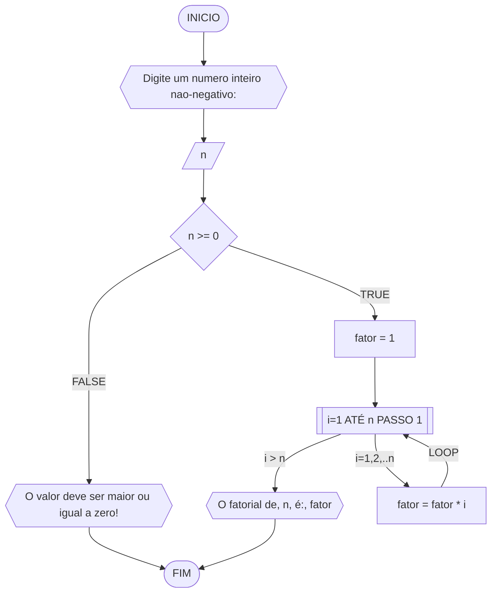
```mermaid
graph
A([INICIO]) --> B{{"Digite um numero inteiro nao-negativo:"}}
B --> C[/n/]
C --> D{n >= 0}
D --TRUE--> E[fator = 1]
D --FALSE--> J{{O valor deve ser maior ou igual a zero!}}
J --> I([FIM])
E --> F[[i=1 ATÉ n PASSO 1]]
F --"i > n"--> H{{O fatorial de, n, é:, fator}}
F --"i=1,2,..n"--> G[fator = fator * i]
G --LOOP--> F
H --> I
```
```
ALGORITIMO_FATORIAL
DECLARE n ,fator, i, INTEIROS
ESCREVA "Digite um numero inteiro não negativo:"
LEIA n
SE n>=0 
	ENTAO
		fator <-- 1
		PARA  i DE 1 ATE n PASSO 1 FAÇA
		fator = fator * i
			FIM_PARA
				ESCREVA: "O fatorial de "n" é: "fator"
	SENAO
		ESCREVA "o valor deve ser igual ou maior que zero!"
FIM
```

| n  | fator | i  | fator = fator * i | saída               |
| -- | --    | -- | --                | --                  |
| 3  | 1     | 1  | 1*1 = 1           |                     |
| 3  | 1     | 2  | 1*2 = 2           |                     |
| 3  | 2     | 3  | 2*3 = 6           | O fatorial de 3 é 6 |

# Questão 6
```mermaid
graph
A([INICIO]) --> B
B{{"Número de termos da série Fibonacci:"}} -->X
C[a = 0] --> D[b = 1]
D --> E[[i=1 ATÉ n PASSO 1]]
E --"i > n"--> J([FIM])
E --"i=1,2,...,n"--> F{{a}}
F --> G[termo_atual = a + b]
G --> H[a = b]
H --> I[b = termo_atual]
I --LOOP--> E
X(n)-->C
```
```
ALGORITO_termofibo
DECLARE a ,b ,n ,i ,termo_atual  INTEIROS
ESCREVA "numero de termos:"
LEIA n
a <--0
b <--1
PARA i DE 1 ATE N PASSO 1 FAÇA
	termo_atual = a+b
	a = b
	b = termo_atual
FIM_PARA
FIM
```
| it | n  | a  | b  | i  | saída | termo_atual = a + b | a = b | b = termo_atual |
| -- | -- | -- | -- | -- | --    | --                  | --    | --              |
| 1  | 5  | 0  | 1  | 1  | 0     | 0 + 1 = 1           | 1     | 1               |
| 2  | 5  | 1  | 1  | 2  | 1     | 1 + 1 = 2           | 1     | 2               |
| 3  | 5  | 1  | 2  | 3  | 1     | 1 + 2 = 3           | 2     | 3               |
| 4  | 5  | 2  | 3  | 4  | 2     | 2 + 3 = 5           | 3     | 5               |
| 4  | 5  | 3  | 5  | 5  | 3     | 3 + 5 = 8           | 5     | 8               |

# Questão 7
```mermaid
flowchart TD
A([INICIO]) --> B{{Digite um número inteiro: }}
B --> C[\num\]
C --> D{num >= 0}
D --TRUE--> G[num_inv = 0]
G --> H{num > 0}
H --FALSE--> Z{{"Número invertido:", numero_inv}}
Z --> W([FIM])
H --TRUE--> I[digito = num % 10]
I --> J[num_inv = num_inv * 10 + digito]
J --> K[numero = numero // 10]
K --LOOP--> H
D --FALSE--> E{{O número deve ser positivo!}}
E --> W
```
```
ALGORITIMO_invertido_omitirogal
DECLARE num ,num_inv ,digito INTEIROS
ESCREVA "digite um numero inteiro:"
LEIA num
SE num >= 0
	ENTAO
	num_inv=0
    ENQUANTO num > 0 FAÇA
    digito = num % 10
    num_inv = num_inv * 10 + digito
    num = num // 10
    FIM ENQUANTO
    ESCREVA "numero invertido:, num_inv"
	SENAO
		ESCREVA "o numero deve ser positivo!"
FIM
```

| it | num | num_inv | num > 0 | digito | num = num // 10 | num_inv = (num_inv * 10) + digito | Saída                       |
| -- | --  | --      | --     | --      | --              | --                                | --                          |
|    | -1  | 0       | False  |         |                 |                                   | O número deve ser positivo! |
| 1  | 0   | 0       | False  |         |                 |                                   | Número invertido:: 0        |
| 1  | 42  | 0       | True   | 2       | 4               | 2                                 |                             |
| 2  | 4   | 2       | True   | 4       | 0               | 24                                |                             |
| 3  | 0   | 24      | False  |         |                 |                                   | Número invertido:: 24       |		
